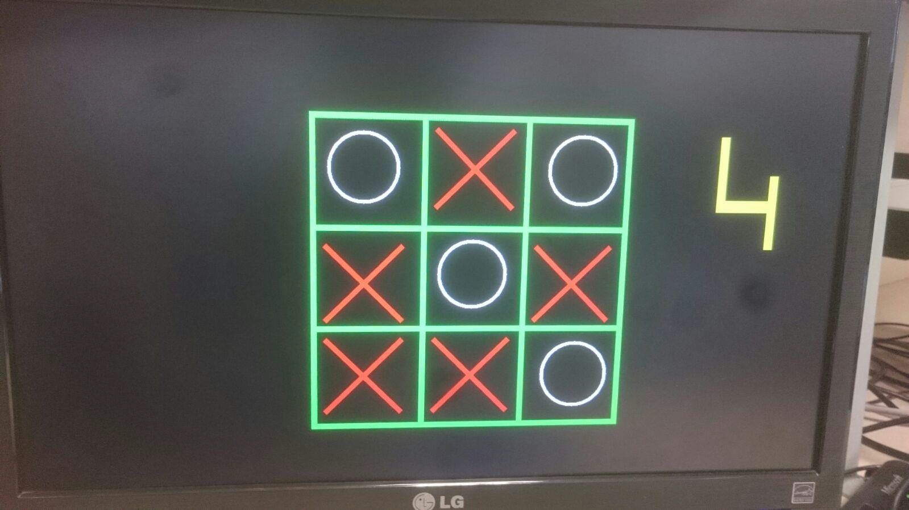

# action-reaction

“Action-Reaction Game” is a two dimensional graphics based multiplayer game that is formed on the user reactance (reflex).

The game is essentially played as follows: when an action such as a mathematical operation is shown, user is expected to react whether it is true or false. Every correct reaction to an action awards one point. The more points, the better :)

Mathematical operations, XOX game and color match are the available actions.
Single player and multi-player modes are available and the user reaction is taken via the switches of BASYS 3.

The game is written in VHDL and implemented via BASYS3 FPGA board for a 1280x720 (60 Hz) VGA monitor.

Some screenshots:

Note: All the pixels are calculated by hand and so drawn manually, as I was apparently unaware of bitmaps :)

<b>Opening Screen

 

<b>Mathematical Operation

 

<b>XOX

 

<b>Color Match

 

<b>Multiplayer XOX

 

<h6> This was a term project of EEE102 course of Bilkent, a <a href="https://www.youtube.com/watch?v=NXxgnfdnT3Q">video</a> explaining the game is available.
